# Math Mentor - Multimodal AI Math Problem Solver

Reliable AI application for solving JEE-style math problems with RAG, Multi-Agent System, and Human-in-the-Loop.

## Architecture

```mermaid
graph TD
    A[User Input] --> B{Input Type}
    B -->|Text| C[Parser Agent]
    B -->|Image| D[OCR Processor] --> E{Confidence Check}
    B -->|Audio| F[Audio Processor] --> G{Confidence Check}
    
    E -->|Low < 0.7| HITL1[HITL Trigger]
    E -->|High ≥ 0.7| C
    G -->|Low < 0.6| HITL1
    G -->|High ≥ 0.6| C
    
    C --> H{Parser Check}
    H -->|Needs Clarification| HITL2[HITL Trigger]
    H -->|Clear| I[Router Agent]
    
    I --> J[Memory Search]
    J --> K[Retriever: RAG + Similar Problems]
    K --> L[Solver Agent + Python Tool]
    L --> M[Verifier Agent]
    
    M --> N{Verification}
    N -->|Confidence < 0.7| HITL3[HITL Trigger]
    N -->|Confidence ≥ 0.7| O[Explainer Agent]
    
    O --> P[User Interface]
    P --> Q[User Feedback]
    Q --> R[Memory Store]
    R --> S[Learning Patterns]
    S -.->|Reuse| K
    S -.->|Apply Corrections| D
    S -.->|Apply Corrections| F
    
    HITL1 --> T[Human Review]
    HITL2 --> T
    HITL3 --> T
    T --> U[Edit/Approve/Reject]
    U --> R
```



## Features

✅ **All Mandatory Requirements Implemented**

### 1. Multimodal Input & Parsing
- **Image Input**: OCR with EasyOCR, confidence scoring, user editing
- **Audio Input**: Whisper ASR, math-specific phrase handling, confirmation
- **Text Input**: Direct typing
- **Low confidence triggers HITL**

### 2. Parser Agent
- Cleans OCR/ASR output
- Identifies ambiguity and missing information
- Structured JSON output with topic classification
- Triggers HITL when needed

### 3. RAG Pipeline
- 4 curated knowledge documents (algebra, probability, calculus, linear algebra)
- ChromaDB vector store with sentence-transformers
- Top-k retrieval with source attribution
- **No hallucinated citations**

### 4. Multi-Agent System (5+ Agents)
1. **Parser Agent**: Raw input → structured problem
2. **Router Agent**: Problem classification and strategy
3. **Solver Agent**: RAG + Python calculator tool
4. **Verifier Agent**: Correctness, units, edge cases
5. **Explainer Agent**: Student-friendly explanations
- **All agents use Claude Sonnet 4**

### 5. Application UI (Streamlit)
- Input mode selector
- Extraction preview with confidence scores
- Agent trace visualization
- Retrieved context display
- Confidence indicators
- Feedback buttons (✅ correct / ❌ incorrect)

### 6. Human-in-the-Loop (HITL)
**Triggers when:**
- OCR confidence < 70%
- Audio confidence < 60%
- Parser detects ambiguity
- Verifier confidence < 70%
- User explicitly requests review

**HITL Flow:**
- Shows severity levels (🔴 high / 🟡 medium)
- Instructions for user action
- Records approvals/edits/rejections
- Stores as learning signals

### 7. Memory & Self-Learning
**Stores:**
- Original input (all modalities)
- Parsed question structure
- Retrieved context
- Solution and verification
- User feedback

**Learning Features:**
- Retrieves similar solved problems
- Reuses successful solution patterns
- Applies learned OCR/audio corrections
- Tracks accuracy by topic
- Identifies most successful strategies
- **No model retraining - pattern reuse**

### 8. Tools Integration
- **Python Calculator**: Safe mathematical expression evaluation
- **RAG Retrieval**: Knowledge base search
- **OCR/ASR Correction**: Learned pattern application

## Setup

### 1. Clone Repository
```bash
git clone https://github.com/krushna27/Math-Mentor---Multimodal-AI-Math-Problem-Solver.git
cd math-mentor
```

### 2. Install Dependencies
```bash
pip install -r requirements.txt
```

### 3. Configure Environment
```bash
cp .env
```

Edit `.env` and add your API keys:
```
GEMINI_API_KEY=your_key
OPENAI_API_KEY=your_key
```

### 4. Run Application
```bash
streamlit run app.py
```

Download: https://www.gyan.dev/ffmpeg/builds/ffmpeg-release-essentials.zip

Extract to C:\ffmpeg

Add C:\ffmpeg\bin to Windows PATH

Restart terminal/IDE


## Usage

1. Select input mode (Text/Image/Audio)
2. Provide your math problem
3. Review extracted/transcribed text
4. Click "Solve Problem"
5. View agent trace, solution, and explanation
6. Provide feedback

## Project Structure

```
math-mentor/
├── app.py                 # Main Streamlit app
├── agents/               # Multi-agent system
│   ├── parser.py
│   ├── router.py
│   ├── solver.py
│   ├── verifier.py
│   └── explainer.py
├── rag/                  # RAG pipeline
│   ├── knowledge_base.py
│   └── retriever.py
├── utils/                # Input processors
│   ├── ocr.py
│   ├── audio.py
│   └── memory.py
├── knowledge/docs/       # Knowledge base
└── data/                 # Memory storage
```

## Deployment

### Streamlit Cloud
1. Push to GitHub
2. Go to share.streamlit.io
3. Deploy from repository
4. Add secrets in Settings


## Technologies

- **LLM**: Claude Sonnet 4 (Anthropic)
- **OCR**: EasyOCR
- **ASR**: OpenAI Whisper
- **Embeddings**: sentence-transformers
- **Vector DB**: ChromaDB
- **UI**: Streamlit

